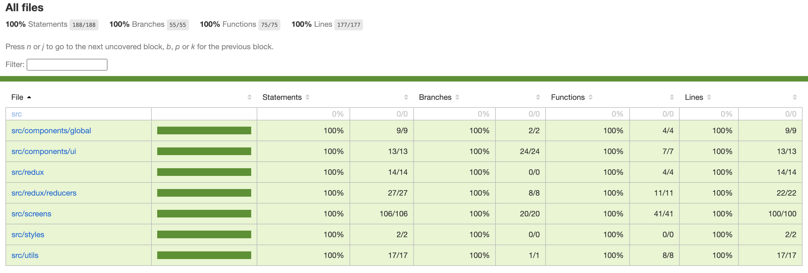

# React Native Project with Testing and CI/CD Integration

## Overview

This project demonstrates a React Native application with a focus on testing and Continuous Integration/Continuous Deployment (CI/CD). The following technologies and tools are implemented:

1. **Unit Testing**: Using Jest with Istanbul for code coverage.
2. **End-to-End Testing**: Using Detox for E2E testing.
3. **CI/CD**: Configured with Fastlane for automated build and deployment processes.

## Features

- Unit testing with Jest.
- Code coverage reporting with Istanbul.
- End-to-End (E2E) testing with Detox.
- Continuous Integration and Deployment (CI/CD) pipeline using Fastlane.

## Project Branches

This repository is divided into the following branches:

1. **`unit-testing`**:

   - Contains the Jest setup and test cases for the project.
   - Istanbul is integrated for code coverage analysis.

2. **`e2e-detox-testing`**:

   - Includes Detox setup for E2E testing.
   - Detox tests for critical user flows.

3. **`CI-CD-FASTLANE`**:
   - Contains Fastlane configurations for CI/CD.
   - Automated tasks such as building the app, running tests, and deploying to the appropriate environment.

## Getting Started

### Prerequisites

- Node.js (v16 or later)
- Yarn or npm
- React Native CLI
- Detox CLI
- Fastlane

### Installation

1. Clone the repository:
   ```bash
   git clone <repository_url>
   cd <repository_name>
   ```
2. Install dependencies:

   ```bash
   yarn install
   # or
   npm install
   ```

3. Setup Detox:

   ```bash
   detox build -c android.emu.debug
   detox test -c android.emu.debug
   ```

4. Run unit tests:

   ```bash
   yarn test
   ```

5. Generate code coverage:

   ```bash
   yarn test --coverage
   ```

   Code coverage reports will be generated in the `coverage` folder.

6. Fastlane setup:
   - Navigate to the `fastlane` directory and configure your Fastlane files for deployment.

## Scripts

The following scripts are defined in `package.json` for common tasks:

```json
"scripts": {
  "android": "react-native run-android",
  "ios": "react-native run-ios",
  "lint": "eslint .",
  "start": "react-native start",
  "test": "jest",
  "lint:fix": "eslint src --fix",
  "format": "prettier --check src && prettier --write src",
  "detox:android": "detox test --configuration android.emu.debug",
  "prepare": "husky install"
}
```

- **`android`**: Run the Android application.
- **`ios`**: Run the iOS application.
- **`lint`**: Lint the codebase.
- **`start`**: Start the Metro bundler.
- **`test`**: Run Jest unit tests.
- **`lint:fix`**: Automatically fix linting issues.
- **`format`**: Check and format the codebase with Prettier.
- **`detox:android`**: Run Detox tests for the Android emulator.
- **`prepare`**: Install Husky for Git hooks.

## Screenshots

### Istanbul Code Coverage

Below is a sample screenshot of the Istanbul code coverage report:



### CI/CD Workflow

Fastlane scripts automate the following tasks:

- Building the React Native app for iOS and Android.
- Running unit and E2E tests.
- Deploying the app to a testing or production environment.

## Branch Details

### 1. Unit Testing (`unit-testing` branch)

- **Tools**: Jest, Istanbul
- **Setup**:
  - Configured with `jest.config.js`.
  - `coverageThreshold` ensures the code meets the minimum coverage percentage.

### 2. E2E Testing (`e2e-detox-testing` branch)

- **Tools**: Detox
- **Setup**:
  - Configured with `detox.config.json`.
  - Tests cover navigation, form validation, and user interactions.

### 3. CI/CD (`CI-CD-FASTLANE` branch)

- **Tools**: Fastlane
- **Setup**:
  - `Fastfile` includes lanes for running tests, building the app, and deploying.
  - Configured for both Android and iOS platforms.

## Contribution

Contributions are welcome! Please follow these steps:

1. Fork the repository.
2. Create a feature branch: `git checkout -b feature-name`.
3. Commit your changes: `git commit -m 'Add some feature'`.
4. Push to the branch: `git push origin feature-name`.
5. Create a pull request.

## License

This project is licensed under the MIT License.

---

For any queries or suggestions, please open an issue or contact the maintainers.
